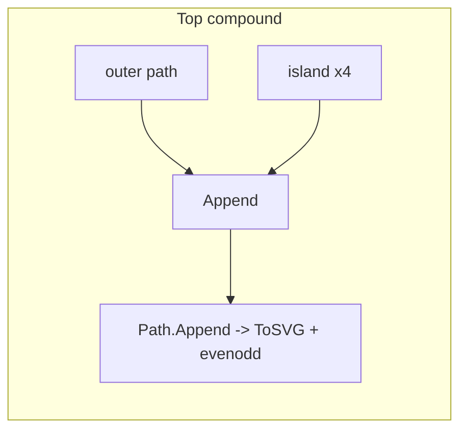

# Implement compound paths with even-odd fill (foobar filigree)

## Goal

Represent the top ornament (current line 90) plus islands (lines 91–95) and the bottom ornament (line 98) plus islands (lines 99–102) as **one SVG path each** with `**fill-rule="evenodd"`, so the interior regions subtract correctly for preview and CAM-friendly semantics.

## Approach

1. **Split data** in `[pkg/signs/foobar.go](pkg/signs/foobar.go)`: keep the existing `d` strings but assign them to named `const` (or grouped `const` blocks) for clarity:

- **Top:** `foobarTopFiligreeOuter` + `foobarTopFiligreeIsland0` … `Island3` (the four strings currently at 92–95).
- **Bottom:** `foobarBottomFiligreeOuter` + four island strings (currently 99–102).

1. **Build compound paths** inside `drawFoobarShapes` (or a small private helper in the same file):

- `ParseSVGPath(outer)` then `.Append(parsedIsland0, parsedIsland1, …)` using `[(*canvas.Path).Append](https://pkg.go.dev/github.com/tdewolff/canvas#Path.Append)` (already available in your dependency).
- Apply the same `Translate(-outerBounds.X0, -outerBounds.Y0)` to the **combined** path once (same as today per-path).
- On parse failure, keep current behavior: log and skip (or `log.Fatalf` if you prefer strictness for these critical paths).

1. **Adjust the `filligree` loop**:

- Change `filligree` from `[]string` to a small struct slice, e.g. `{ d string; fillRule string }` where `fillRule` is `""` for normal paths and `"evenodd"` for the two compounds **or** keep `[]string` for simple paths and handle the two compounds **before** or **after** the loop with explicit `AddPath` calls (second option avoids touching every simple entry).
- Minimal-touch option: `filligree []string` remains only the **non-merged** entries (lines 84–89, 96–97, 103–108 after renumbering), and two separate `AddPath` calls for top/bottom compounds with `fill-rule` set.

1. **Emit attributes** for compound paths only: extend the existing map passed to `builder.AddPath` with `"fill-rule": "evenodd"` (`[SVGBuilder.AddPath](pkg/svgutils/svgutils.go)` already forwards arbitrary attributes).
2. **Verify subpath closure**: The island paths and outer paths are filled shapes; if any subpath fails to render as a hole, add an explicit `Z` at the end of that subpath in the source `d` (only if needed after visual check).
3. **Validate**: `go build ./...` and regenerate a sample SVG; confirm in a browser or Inkscape that the four regions appear as holes inside each large flourish.

## Files to change

- `[pkg/signs/foobar.go](pkg/signs/foobar.go)` — only file expected to change for this feature.

## Out of scope

- No changes to `[pkg/svgutils/svgutils.go](pkg/svgutils/svgutils.go)` unless you later want a typed helper (e.g. `AddPathEvenOdd`); raw `"fill-rule"` in the map is enough.
