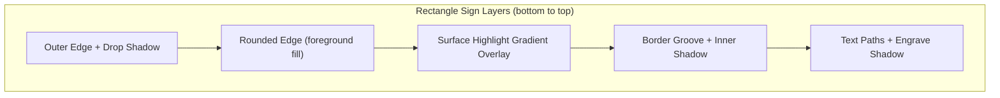

# Add Realistic Depth Effects to Rectangle SVG

## Context

The current SVG output uses flat solid fills with no depth. Physical CNC signs have carved grooves, beveled edges, and natural lighting that creates shadows and highlights. We can simulate this entirely with SVG `<filter>` and `<linearGradient>` definitions applied to existing paths -- only when `strokeOnly` is false (the display/preview mode).

The sign coordinate system is in inches (typical sign: ~18" x 12"). The initial SVG tag in `svgutils.go` writes `mm` units but `svg.go` overrides to `width="100%"` with a `viewBox` in inches. Filter values like `stdDeviation` and offsets are in user-space (inches).

## Effects Breakdown

Applied to the rectangle sign's existing layers:

1. **Drop shadow** on the outer edge -- sign appears to float above the page
2. **Surface highlight gradient** on the foreground (rounded edge) -- subtle top-to-bottom gradient simulating overhead light hitting the sign surface
3. **Inner shadow (groove effect)** on the border paths -- makes the V-carved border channel look recessed
4. **Text emboss** on text paths -- makes text appear carved into the surface with a shadow on one edge

All effects use color-independent techniques (semi-transparent black/white overlays) so they work with any foreground/background color combination.

## File Changes

### 1. [pkg/svgutils/svgutils.go](pkg/svgutils/svgutils.go) -- Add `<defs>` support

Add two methods to `SVGBuilder`:

- `**AddDefs(content string)` -- writes `<defs>content</defs>` to the buffer. Called early (before groups) to define filters and gradients.
- `**AddRawContent(content string)` -- writes arbitrary SVG markup to the buffer. Used to add overlay paths (e.g., a gradient-filled duplicate of the surface path for lighting).

### 2. [pkg/signs/rectangle.go](pkg/signs/rectangle.go) -- Apply effects when `!strokeOnly`

Add a helper function `rectangleDefs(width, height float64) string` that returns the SVG `<defs>` block containing:

```xml
<defs>
  <!-- Drop shadow for outer sign (inches: ~0.1" offset, ~0.15" blur) -->
  <filter id="sign-shadow" x="-5%" y="-5%" width="115%" height="115%">
    <feDropShadow dx="0.1" dy="0.1" stdDeviation="0.15"
                  flood-color="#000000" flood-opacity="0.35"/>
  </filter>

  <!-- Inner shadow for V-carved border groove (inches: ~0.03" offset, ~0.04" blur) -->
  <filter id="groove-shadow" x="-50%" y="-50%" width="200%" height="200%">
    <feComponentTransfer in="SourceAlpha">
      <feFuncA type="table" tableValues="1 0"/>
    </feComponentTransfer>
    <feGaussianBlur stdDeviation="0.04"/>
    <feOffset dx="0.03" dy="0.03" result="offsetblur"/>
    <feFlood flood-color="#000000" flood-opacity="0.4" result="color"/>
    <feComposite in2="offsetblur" operator="in"/>
    <feComposite in2="SourceAlpha" operator="in"/>
    <feMerge>
      <feMergeNode in="SourceGraphic"/>
      <feMergeNode/>
    </feMerge>
  </filter>

  <!-- Inner shadow for engraved text (inches: ~0.02" offset, ~0.03" blur) -->
  <filter id="text-engrave" x="-50%" y="-50%" width="200%" height="200%">
    <feComponentTransfer in="SourceAlpha">
      <feFuncA type="table" tableValues="1 0"/>
    </feComponentTransfer>
    <feGaussianBlur stdDeviation="0.03"/>
    <feOffset dx="0.02" dy="0.02" result="offsetblur"/>
    <feFlood flood-color="#000000" flood-opacity="0.5" result="color"/>
    <feComposite in2="offsetblur" operator="in"/>
    <feComposite in2="SourceAlpha" operator="in"/>
    <feMerge>
      <feMergeNode in="SourceGraphic"/>
      <feMergeNode/>
    </feMerge>
  </filter>

  <!-- Surface lighting gradient (color-independent) -->
  <linearGradient id="surface-highlight" x1="0" y1="0" x2="0" y2="1">
    <stop offset="0%" stop-color="white" stop-opacity="0.12"/>
    <stop offset="50%" stop-color="white" stop-opacity="0.03"/>
    <stop offset="100%" stop-color="black" stop-opacity="0.08"/>
  </linearGradient>
</defs>
```

Then modify the existing path attributes conditionally:

| Element      | Current         | With Effects (`!strokeOnly`)                                                           |
| ------------ | --------------- | -------------------------------------------------------------------------------------- |
| Outer edge   | `fill: bgColor` | add `filter="url(#sign-shadow)"`                                                       |
| Rounded edge | `fill: fgColor` | keep fill, then add a **duplicate overlay path** with `fill="url(#surface-highlight)"` |
| Border outer | `fill: bgColor` | add `filter="url(#groove-shadow)"`                                                     |
| Border inner | `fill: fgColor` | add `filter="url(#groove-shadow)"`                                                     |
| Text paths   | `fill: bgColor` | add `filter="url(#text-engrave)"`                                                      |

The overlay path for the surface highlight is the same `roundedEdge.ToSVG()` path drawn a second time with `fill="url(#surface-highlight)"` -- this creates a transparent gradient on top of the solid fill, simulating overhead light without needing to manipulate the actual color values.

### 3. [pkg/svg/svg.go](pkg/svg/svg.go) -- Remove redundant CSS drop-shadow

The CSS `filter: drop-shadow(...)` on the root `<svg>` element (line 59) should be conditionally omitted when the proper SVG `<filter>` shadow is used, or removed entirely in favor of the new SVG filter-based shadow. This avoids doubling up shadows.

## Visual Result



The sign will appear as a physical object: floating above the page with a cast shadow, a subtle light gradient across the surface, recessed border grooves with shadow on one edge, and carved text with depth.
