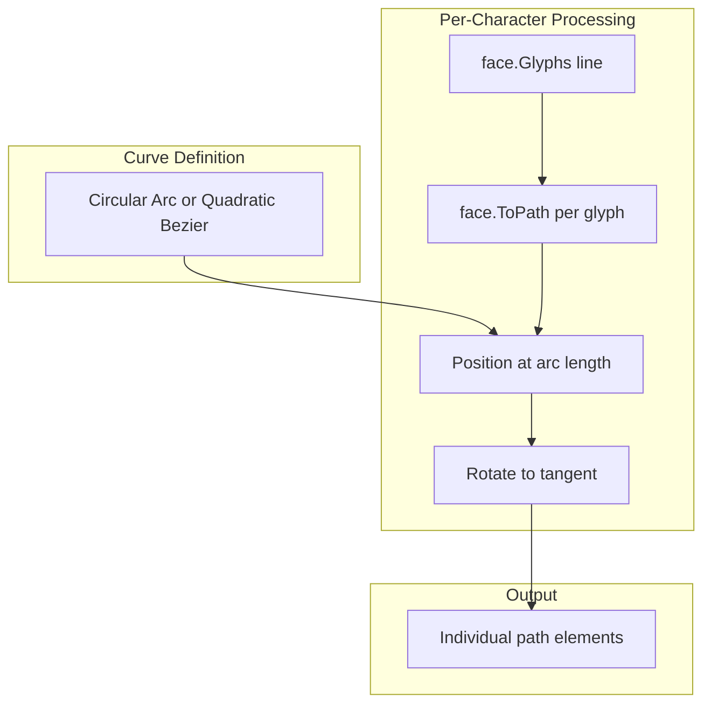

# Curved Top-Line Text for Sora Sign

## Summary

Yes, this is possible. The approach: render the top line character-by-character, placing each glyph along a curve with rotation derived from the curve's tangent, while preserving natural spacing from the font's advance widths.

## Architecture

## Curve Definition Options

**Recommended: Circular arc** — Simplest to implement and tune. One center point, radius, and angle span. For a shallow "smile" at the top: center slightly below the text baseline, arc curving downward.

**Alternative: Quadratic Bézier** — More flexible (start, end, control point). Can better match the sign's scalloped bottom if desired.

**Not recommended: Elliptical arc** — More complex parametrization; circular arc is usually sufficient for sign text.

## Implementation Approach

### 1. Create a curve utility (new file or in sora.go)

- **Circular arc**: `posAtArcLength(center, radius, thetaStart, thetaEnd, s)` returns (x, y, angle)
- Arc length for circle segment: `L = r * |thetaEnd - thetaStart|`
- Position at fraction `t = s/L`: `theta = thetaStart + t*(thetaEnd - thetaStart)`
- `angle` = tangent direction = `theta + 90°` (or `theta - 90°` depending on sweep)

### 2. Character-by-character placement

- Use `face.Glyphs(line)` to get per-glyph data (advance widths, clusters). Fallback: iterate runes and use `face.ToPath(string(rune))` + `face.TextWidth(string(rune))` for spacing.
- Compute total text width at scale 1.0 to determine scale factor (same as current logic).
- For each glyph:
  - Get path via `face.ToPath(glyphString)`, scale to fit
  - Map cumulative advance along the curve using arc-length parametrization
  - Get (x, y, angle) at that arc length
  - Transform: translate to origin, rotate by angle, translate to (x, y)
  - Apply existing Y-flip: `Scale(1, -1)` and `Translate(0, height)`

### 3. Curve parameters (size-dependent)

| Size   | Height | Suggested arc center Y | Radius | Notes                     |
| ------ | ------ | ---------------------- | ------ | ------------------------- |
| Small  | 7.5    | ~6.5                   | ~8     | Shallow arc               |
| Medium | 9      | ~7.5                   | ~10    | Match current top padding |
| Large  | 11     | ~9.5                   | ~12    | Proportionally similar    |

Arc should span roughly the text container width (e.g. `width - 5.25` for 3-line layout). Center X = `width/2`.

### 4. Spacing

- Use `face.TextWidth()` and glyph advances from `face.Glyphs()` to preserve natural spacing.
- Distribute characters along the curve by cumulative advance width (normalized to arc length), so spacing matches horizontal layout.

## Key Files

- [pkg/signs/sora.go](pkg/signs/sora.go): Modify the text-drawing loop (lines 253–314). Add a branch for `i == 0` (top line) that uses the curved path logic; keep existing logic for lines 2 and 3.

## Canvas Library Usage

- `Path.Length()` — arc length of the curve (if using a Path as the curve)
- `Path.Direction(seg, t)` — tangent for rotation (if using Path)
- `face.Glyphs(s)` — glyphs with advances (from `github.com/benoitkugler/textlayout`)
- `face.TextWidth(s)` — total width
- `Path.Transform(Matrix)` — for rotation (canvas has `Identity.Rotate(deg)`)

## Edge Cases

- **Single character**: No rotation needed; center on arc midpoint.
- **Empty top line**: Skip curved path.
- **Very long text**: Scale down to fit arc length (same as current container scaling).
- **Only 1 line**: Apply curve to that single line.

## Optional: SVG `<textPath>`

SVG supports `<text><textPath href="#curve">Text</textPath></text>`. However, CNC output typically requires paths (outlines), not live text. The canvas library converts text to paths via `ToPath`, so the character-by-character approach is appropriate for CNC toolpaths.
